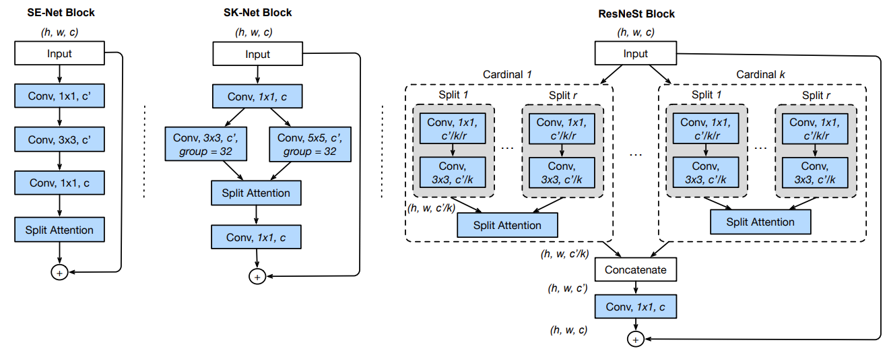

# PyTorch Implementation of ResNest (for performance comparison in paper "Multihead Neural Network for Multiple Segmented Images-based Diagnosis of Thyroid-associated Orbitopathy Activity.")
 
The preprocessing and architecture can be referenced by a manuscript entitled, "Resnest: Split-attention networks." 

## Overview
This repository contains an unofficial implementation of ResNest using PyTorch.<br/>


## Neural Network Block

## Paper
If you use this software for your research, please cite:

```bibtex
@inproceedings{zhang2022resnest,
  title={Resnest: Split-attention networks},
  author={Zhang, Hang and Wu, Chongruo and Zhang, Zhongyue and Zhu, Yi and Lin, Haibin and Zhang, Zhi and Sun, Yue and He, Tong and Mueller, Jonas and Manmatha, R and others},
  booktitle={Proceedings of the IEEE/CVF conference on computer vision and pattern recognition},
  pages={2736--2746},
  year={2022}
}
```

## License
This program is available for download for non-commercial use, licensed under the GNU General Public License. This allows its use for research purposes or other free software projects but does not allow its incorporation into any type of commercial software.

## Files
The repository contains the following files:
- `ResNest.py`: Python script file, containing the PyTorch implementation of the ResNest
- `ResNest_Block.png`: Figure file for network block
- `README.md`: Markdown file explaining the model source code
